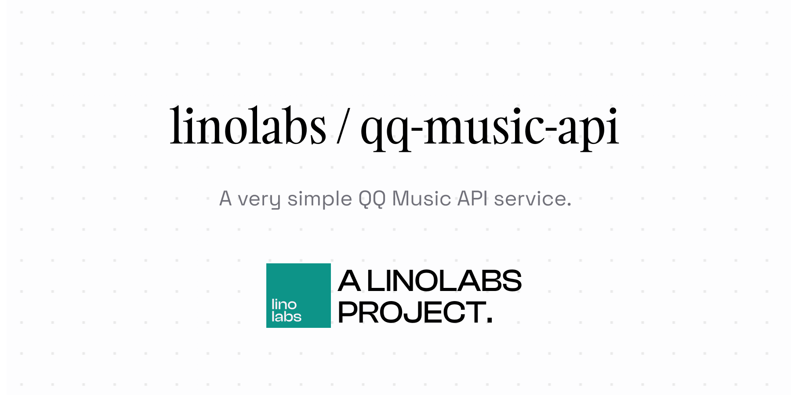

# QQ Music API

## Usage

`GET /api/search/song`

```typescript
const res = await fetch('/api/search/song',{
    params:{
        key:'Search Content Here'
    }
})

console.log(await res.json())
// [
//     {
//         mid:'mid string',
//         name: 'Song Name',
//         singer: 'Singer Name',
//         url:'An url'
//     },
//     ...
// ]

```
